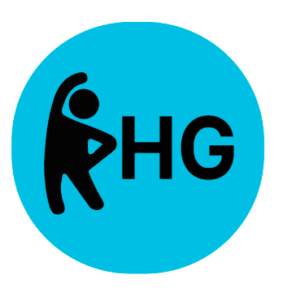

# Proyecto Healthy Glow

# Equipo

[Cruz Inzunza Luis Alejandro](https://github.com/Luis-Inzunza)

[Carlos Genaro Cutz Anguas](https://github.com/GenaroCutzAnguas)

[Armando Canche Tintoré](https://github.com/ArmandoCanche)

[Leticia Tejero Gamboa](https://github.com/LeticiaTejeroGamboa2401) 

[Reynaldo Cohuo Martin](https://github.com/ReynaldoCoMa)

[Competencias de equipo](Documentacion/Competencias.md)

# Descripcion General

Este repositorio guarda el progreso del proyecto **Healthy Glow** para la materia de Fundamentos de Ingenieria de Software, en el cual brindaremos informacion sobre ejercicios aerobicos a proponer para los alumnos de 1er semestre (y futuramente a los demas semestres) de la FMAT de la UADY.

# ¿Que es Healthy Glow?

Es una iniciativa de alumnos de 1er semestre para incetivar a nuestros compañeros de FMAT de la UADY a realizar ejercicio y/o actividad física para mejorar su calidad de vida.

# Indice
* [Objetivos](Documentacion/1ra_Entrega/Objetivo.md)
* [Usuarios](Documentacion/1ra_Entrega/Usuarios.md)
* [historias de usuarios](Documentacion/1ra_Entrega/Historias_de_Usuarios.md)
* [Metodologia y roles](Documentacion/1ra_Entrega/Metodologia_y_roles.md)
* [Requerimientos](Documentacion/1ra_Entrega/Requerimientos.md)
* [Diseños](Documentacion/2ra_Entrega/Disenos/disenos_text.md)
* [Implementación](Documentacion/2ra_Entrega/Implementacion.md)
* [Pruebas y plan de mejoras](Documentacion/2ra_Entrega/)
* [Contenido a mostrar](Documentacion/Introduccion_a_la_informacion.md)
* [Bitacoras](Documentacion/Bitacoras.md)

# Primera entrega

* [Presentacion](Documentacion/1ra_Entrega/Proyecto_HealthyGlow.pdf)

* [Metricas de contribucion individual](Documentacion/1ra_Entrega/Metricas.pdf)

* [Video de presentacion](https://www.youtube.com/watch?v=S1l2323O1bI)

# Segunda entrega

* [Presentacion]()

* [Metricas de contribucion individual](metricas_de_cont2.pdf)

* [Video de presentacion](https://youtu.be/EplGZAQU7QQ)
